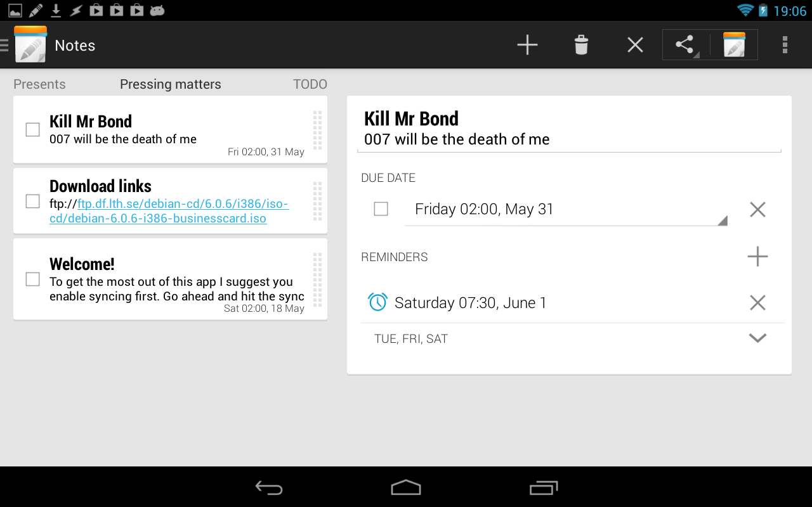
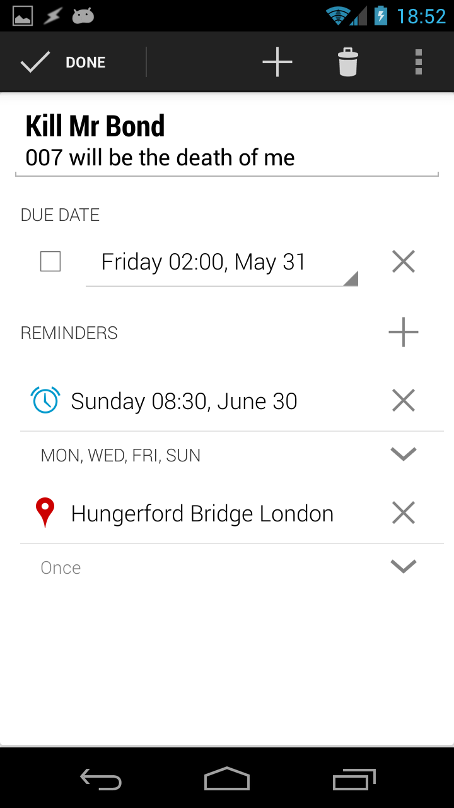

# Getting sync to work
You need to put your API keys in a file, like the sample here:
https://github.com/spacecowboy/NotePad/blob/master/core/assets/secretkeys.properties.sample

But first you will of course need to get yourself a key. Follow the instructions on this page:
https://developers.google.com/google-apps/tasks/firstapp

Scroll to the section named __Register your project__.

And similar over here https://www.dropbox.com/developers/apps

# Build the project

Enter the full directory and call

    gradle installDebug

